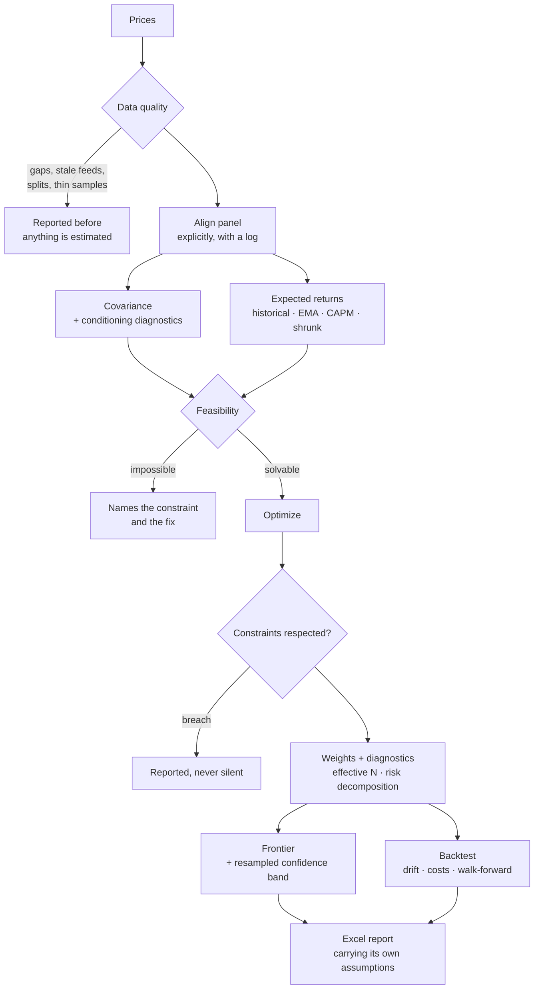

# Optimization Engine

A multi-asset portfolio optimization engine with a clean API, a Streamlit
UI, and a CLI. Built on top of `cvxpy`, `scipy`, `pandas`, and `plotly`.

The engine is opinionated about one thing: **an allocation is not a result
until you can see what it rests on.** Every solve returns the weights *and*
the evidence — which solver answered, whether the constraints were actually
respected, how well-conditioned the covariance estimate was, how concentrated
the book is in risk rather than capital, how much of the backtest survives out
of sample, and how much of *that* survives the number of configurations you
tried before settling on this one.


## The five questions it answers

### 1. Where does this portfolio sit, and what else was available?

The frontier is drawn with the portfolios worth marking on it — the
minimum-variance anchor where the efficient branch starts, the tangency
portfolio, the capital allocation line through it, and where your own
allocation actually landed. The sweep range comes from what the constraints
can reach, so a binding position cap shortens the curve instead of silently
failing half of it.


### 2. How much of that curve is real?

The frontier is a point estimate of a curve. Resample the return history and
re-trace it, and the curve moves a great deal: on the sample panel the
expected return at a typical risk level spans a **6.3-percentage-point band**.
Differences narrower than that band are not distinguishable from estimation
noise, which is a useful thing to know before defending a 20bp allocation
difference in a meeting.


### 3. Where is the risk, as opposed to the money?

Capital weight and risk share are different quantities, and optimizers are
happy to let them diverge. Here a 26% position in EM equity carries **71% of
the portfolio's risk** — the gap between the two bars is the entire argument
for risk budgeting, and it is invisible in a weights table.


### 4. Would any of this have worked?

The optimizer estimated its inputs from the same returns a naive backtest
replays, so a fitted track record is a description of the past, not a
forecast. The walk-forward re-estimates and re-solves on a rolling window and
holds each solution over returns the optimizer never saw. Same rebalancing
cadence and the same 15bps of trading cost on both lines, so the gap is
overfitting rather than a cost artefact: **Sharpe 0.74 fitted against 0.23
walk-forward.**


### 5. Is any of that real, or did you try forty things and report the best?

A library with ten methods, six covariance estimators and a grid of
constraints makes it easy to run forty configurations and present the winner.
The maximum of forty noisy estimates is a biased estimate of the best true
value, and nothing about that bias shows up in the number itself.

Take 50 strategies drawn from the *same zero-mean distribution* — no skill
anywhere. The best posts an annualized Sharpe of 1.24, and the probabilistic
Sharpe ratio calls it significant at 99.3%. Deflate it for the fact that it was
the best of 50 and it drops to **45.6%**: a coin flip, which is what it is.

`optengine optimize --trials 40` makes that declaration part of the run, and
`probability_of_backtest_overfitting()` asks the complementary question — across
every balanced split of the sample, how often does the in-sample winner land
below the out-of-sample median?

There is a prior question too, which `monte_carlo_optimization_selection()`
answers: given a universe like this one and a sample this long, which method
can be trusted to find the right answer at all? On the sample panel a direct
mean-variance solve misplaces its weights by 14.8% RMSE between simulated
histories drawn from the same distribution. Nested Clustered Optimization
misplaces them by 0.01%.

*Every figure above is produced by `python scripts/render_docs_images.py` from
the built-in sample dataset, using the same plotting code the app calls — so
what the README shows is what the library draws.*

## What's inside

**Optimization techniques**


| Method | Class | When to use |
| --- | --- | --- |
| Mean-variance (target return / vol / utility) | `MeanVarianceOptimizer` | Classic Markowitz with full constraints |
| Global minimum variance | `MinVarianceOptimizer` | You don't trust any expected-return estimate |
| Maximum Sharpe ratio | `MaxSharpeOptimizer` | Tangency portfolio, sized separately against cash |
| Risk parity / risk budgeting (ERC) | `RiskParityOptimizer` | Spread *risk* evenly, not capital |
| Hierarchical Risk Parity (HRP) | `HRPOptimizer` | Many assets, ill-conditioned covariance, small T/N |
| Hierarchical Equal Risk Contribution (HERC) | `HERCOptimizer` | HRP's robustness, but splitting at the tree's own branches — and optionally on drawdown or tail risk |
| Nested Clustered Optimization (NCO) | `NCOOptimizer` | Mean-variance keeps producing corner solutions on a correlated universe |
| Black-Litterman | `BlackLittermanOptimizer` | A few specific views on top of equilibrium |
| Mean-CVaR (Rockafellar-Uryasev) | `CVaROptimizer` | Skewed or fat-tailed returns; variance is the wrong measure |
| Mean-CDaR (Chekhlov-Uryasev) | `CDaROptimizer` | The mandate is written in drawdown terms — a stop-loss, a high-water mark |
| Maximum diversification | `MaxDiversificationOptimizer` | Correlation benefit as the objective |
| Inverse volatility | `InverseVolatilityOptimizer` | Cheap risk-parity approximation |
| Equal weight (1/N) | `EqualWeightOptimizer` | The baseline everything else has to beat |

`optengine describe <name>` prints what a method needs, what it supports, and
what it assumes — the same text the UI shows next to the method picker.

**Constraints**

* Per-asset weight bounds.
* Group / asset-class bounds (e.g. equity 30–70%).
* Long-only or long-short with a gross-exposure cap.
* Target return, target volatility, or risk-aversion utility.
* Turnover budget against a previous allocation.

Every constraint is honoured by every method, but not always the same way.
Convex solves impose them directly; the allocate-then-constrain methods (1/N,
inverse volatility, HRP) project onto the *closest* feasible allocation and
report how far the mandate moved their answer — because a 1/N book that had
to shift 15% of its weight is no longer really 1/N. Where a constraint truly
cannot bind (a turnover budget on the homogeneous max-Sharpe,
max-diversification and risk-parity solves), the method warns rather than
ignoring it silently. After every solve the weights are checked against every
constraint and any breach is reported.

**Covariance estimators**

`sample`, `ledoit_wolf`, `oas`, `ewma` (RiskMetrics), `semi`,
`shrink` (riskfolio passthrough when installed), and `denoised`.

Every estimate is symmetrized and PSD-repaired, and comes with diagnostics:
observations per asset, condition number, smallest eigenvalue, and effective
sample size — with a warning when the estimate is too thin or too
ill-conditioned to optimize against.

Shrinkage pulls the whole matrix toward a target, attenuating signal and noise
alike. **Denoising** (López de Prado, 2020) is a sharper instrument: fit the
Marchenko-Pastur law to the eigenvalue spectrum, replace the eigenvalues below
the noise edge λ₊ with their average, and leave the factor eigenvectors
untouched. **Detoning** additionally strips the market eigenvector, which is
what the clustering methods want to see — with the market component in place
every pair of equities looks alike and the hierarchy degenerates.

Both compose with any estimator (`covariance_matrix(..., denoise=True,
detone=1)`), and both report what they found rather than what they hoped for:

```
Marchenko-Pastur fit on 2015 observations of 13 assets (T/N = 155.0) put the
noise edge at λ₊ = 1.167. 2 of 13 eigenvalues sit above it, carrying 62.9% of
total variance. The correlation's condition number went 18.4 → 11.2; the
covariance's went 1.25e+04 → 1.23e+04 — so this covariance's conditioning is
driven by the spread of the volatilities, not by correlation noise, and no
eigenvalue filter will improve it.
```

That last clause is the honest half. Denoising did what it claims and this
panel's problem was somewhere else.

**Expected returns**

`historical_mean`, `ema`, `capm`, and `shrunk_mean` (Jorion Bayes-Stein
shrinkage toward the minimum-variance portfolio's return, which keeps the
cross-sectional ranking while pulling in the extremes that drive
mean-variance to corner solutions).

**Analytics**

Drawdown episodes with recovery timing, Ulcer index, VaR/CVaR (historic and
Cornish-Fisher), Sharpe, probabilistic Sharpe, Sortino, Calmar, Omega, tail
ratio, hit rate, rolling metrics, Newey-West annualized volatility, the full
Euler risk decomposition in volatility units, concentration measures
(Herfindahl, effective N, effective N of *risk*, diversification ratio), and
benchmark-relative statistics: tracking error, information ratio, CAPM alpha
with its t-statistic and R², up/down capture, conditional (up/down) beta, and
active share.

**How many bets is this, really?**

Effective N counts positions and effective N of risk counts risk shares, but
both are computed asset by asset — so neither notices that ten European bank
stocks are one bet. Meucci's effective number of bets rotates the portfolio
into *uncorrelated* factors first. The two available rotations disagree, and
the disagreement is the diagnostic. An equal-weight book on the sample panel:

| Rotation | Effective bets | Largest single bet |
| --- | --- | --- |
| Minimum torsion | 9.78 of 13 | 15% |
| PCA | 1.56 of 13 | 89% |

Thirteen distinct, nameable positions; one dominant driver. `run.diversification_comparison()`
reports both, because neither is "the" answer — PCA measures how much
independent variation you are exposed to, minimum torsion how many distinct
positions you take.

**Active management (Grinold-Kahn)**

For a portfolio measured against a benchmark, the engine computes the pieces of
the fundamental law `IR ≈ TC · IC · √BR`:

* The **information coefficient** from a forecast panel, with the t-statistic
  that says whether the skill is distinguishable from zero.
* The **transfer coefficient** — how much of the forecast survived the mandate.
  The engine knows exactly which constraints were applied and what the
  unconstrained answer would have been, so this is a measurement rather than an
  estimate. A transfer coefficient of 0.35 says two thirds of the skill is
  being absorbed by the constraints, which points at a different fix than "get
  better signals".
* **Grinold's alpha**, `α = IC · σ · z`, which turns a score into a defensible
  expected return. With an IC of 0.05, a two-standard-deviation view on a
  20%-vol asset is worth 2% — not the 10% that gets typed into a spreadsheet,
  and the difference is exactly what stops mean-variance cornering.
* **Risk-aversion calibration**, `λ_A = IR / (2ψ*)`: a tracking-error budget
  and a believed information ratio imply the utility coefficient, rather than
  it being guessed.
* The Euler decomposition of **tracking error**, which disagrees with the
  absolute one precisely on the large benchmark positions that carry plenty of
  risk and no *active* risk at all.
* `implied_breadth()` run backwards is a plausibility check: an IR of 1.0 on an
  IC of 0.03 needs 1,111 independent bets a year.

**Estimation error**

The engine spends a lot of effort saying that expected returns and
covariances are noisy — condition numbers, T/N ratios, walk-forward
degradation — so it does not then draw the frontier as a single crisp line and
leave it there:

* `bootstrap_frontier()` resamples the return history (block, IID or
  parametric), re-estimates and re-traces the frontier on each draw, and
  returns the resulting confidence band plus the per-asset weight dispersion.
  On the sample panel the frontier's expected return spans a 6.3-percentage-
  point band at a typical risk level — differences narrower than that are not
  distinguishable from noise.
* `resampled_efficient_frontier()` implements Michaud-style resampling:
  averaging weights across draws at each frontier rank, which lifts the mean
  effective N from 3.3 to 5.2 on the sample panel because the optimizer stops
  acting on differences the data cannot resolve.
* `monte_carlo_optimization_selection()` asks the prior question: given a
  universe like this one and a sample this long, *which method can be trusted
  to find the right answer at all?* It declares the fitted `μ` and `Σ` to be
  the truth, draws synthetic histories from them, re-estimates and re-solves on
  each, and measures how far each method lands from the answer that truth
  implies (López de Prado, 2019). Over 20 draws on the sample panel:

  | Method | Weight RMSE | Worst single position |
  | --- | --- | --- |
  | `nco` | 0.01% | 0.01% |
  | `herc` | 0.02% | 0.05% |
  | `hrp` | 0.05% | 0.13% |
  | `min_variance` | 0.59% | 1.51% |
  | `mean_variance` | **14.79%** | **35.53%** |

  Each method is scored against *its own* answer on the truth, not a common
  one — the question is estimation stability, not which objective is right.

**Selection bias**

Running forty configurations and reporting the best one is easy in a library
with ten methods, six covariance estimators and a grid of constraints. The
maximum of forty noisy estimates is a biased estimate of the best true value,
and nothing about that bias is visible in the number itself.

* `deflated_sharpe_ratio()` (Bailey & López de Prado, 2014) deflates against
  the expected maximum across the trials you actually ran, adjusted for skew
  and kurtosis. Take 50 strategies drawn from the *same zero-mean
  distribution*: the best posts an annualized Sharpe of 1.24 and a
  probabilistic Sharpe of 99.3%. Its deflated Sharpe is **45.6%**.
* `minimum_track_record_length()` says how much history you would need before
  the observed Sharpe is significant. Usually a bracing answer.
* `probability_of_backtest_overfitting()` implements CSCV: across every
  balanced split of the sample, how often does the in-sample winner land below
  the out-of-sample median? Above ~50% your selection process is a coin flip.

`optengine optimize --trials 40` makes the declaration explicit. The default of
1 is a claim, and the output says so.

**Backtesting**

Two things a constant-weight in-sample replay hides, and this doesn't:

* `backtest_weights()` lets positions drift between rebalances, trades the
  book back on a chosen cadence, and charges transaction costs on traded
  notional — reporting turnover and the annualized cost drag.
* `walk_forward_backtest()` re-estimates and re-solves on a rolling (or
  expanding) window and holds each solution forward over returns the
  optimizer never saw. `compare_in_and_out_of_sample()` puts the two track
  records side by side with the degradation between them.

  Expected returns are re-derived inside each window by default
  (`reestimate_expected_returns=True`). This matters more than it sounds:
  `config.expected_returns` is normally populated — the UI seeds that table
  from the *full* history — so reusing it would hand every "out-of-sample"
  window an estimate built partly from its own future. On the sample panel
  that look-ahead lifts walk-forward Sharpe from 0.46 to 0.89. Turn it off
  only when your expected returns are genuine forward-looking assumptions
  rather than estimates from the same data.

## How a run flows



## Layout

```
src/optimization_engine/
├── analytics/        # performance · risk · relative · backtest
│                     # active (Grinold-Kahn) · diversification (Meucci)
│                     # selection (deflated Sharpe · PBO)
├── data/             # loaders · covariance · denoising · data-quality
├── optimizers/       # one file per technique + diagnostics + feasibility
├── reporting/        # Excel exporter + Plotly figures
├── config.py         # YAML/JSON-driven config
├── engine.py         # high-level façade (run_engine)
├── frontier.py       # efficient frontier sweep
├── resampling.py     # bootstrap bands · Michaud resampling · MCOS
└── cli.py            # `optengine` entrypoint
app/
├── streamlit_app.py  # interactive UI
└── components.py     # reusable render blocks
config/               # example configs
docs/RESEARCH.md      # the literature behind the methods, and what was left out
docs/images/          # README figures (regenerate with scripts/)
notebooks/            # quickstart notebook
scripts/              # batch runners + docs-figure renderer
tests/                # pytest suite
```

## Install

```bash
pip install -e ".[ui,extras,dev]"
```

The `extras` pull `riskfolio-lib`; `ui` pulls Streamlit and ipywidgets.
Without `extras` the engine falls back to scikit-learn's Ledoit-Wolf for
the `shrink` covariance method.

## Use it

### Streamlit UI

```bash
streamlit run app/streamlit_app.py
```

The sidebar walks a numbered path — **Data → Currency → Method →
Assumptions → Objective → Exposure → Frontier** — and each step surfaces what
could make the next one wrong.

1. **Data** — data-quality report before anything is estimated: interior
   gaps, stale feeds that read to an optimizer as low volatility, unadjusted
   splits, and how many periods actually have every asset present. The
   missing-data policy is an explicit choice, and the app logs exactly what it
   did to the panel.

   
2. **Assets** — per-asset statistics (extended metrics on a toggle) plus a
   drawdown-episode table with peak, trough, recovery and time underwater.
3. **Assumptions & constraints** — editable expected returns, weight bounds,
   groups, group budgets, per-method inputs (risk budgets, Black-Litterman
   views both absolute and relative, cluster counts and linkage for HERC/NCO,
   the CDaR tail), the covariance estimator with its **denoising and detoning**
   toggles, and a **live feasibility check** that names the constraint making
   the problem impossible and what to change, before you ever press solve.

   
4. **Optimize** — a compliance banner, KPI cards, concentration and
   diversification measures, a capital-vs-risk chart, the full Euler
   decomposition, and a frontier marked with the minimum-variance and
   tangency portfolios, the capital allocation line, and where your portfolio
   actually sits — plus an opt-in panel that redraws the frontier as a
   confidence band and names the positions the sample cannot pin down.
5. **Backtest** — choose a rebalancing cadence and transaction costs; see
   weight drift, cost drag, rolling performance, the return distribution with
   its VaR/CVaR cuts, benchmark-relative statistics, and a walk-forward run
   that says in words how much of the result was hindsight.
6. **Compare / What-if** — saved scenarios side by side, and live re-solving
   as you drag weight bounds.
7. **Report** — one-click Excel export carrying assumptions, diagnostics,
   data-quality findings and the walk-forward comparison alongside the
   weights.

The sidebar's **📚 Scenarios** block saves, updates, loads, renames, deletes,
and downloads/uploads named profiles (YAML).

### CLI

```bash
optengine list-optimizers                    # each method with a one-line summary
optengine describe hrp                       # what it needs, supports, assumes
optengine sample-data --output data/sample/sample_prices.csv

# Pre-flight the inputs and constraints without solving.
optengine check --config config/example_multi_asset.yaml --sample

# Solve, and refuse rather than fail obscurely if the mandate is impossible.
optengine optimize --config config/example_multi_asset.yaml --sample \
    --frontier --resample 50 --walk-forward --cost-bps 10 --strict

# Filter the covariance's noise eigenvalues, declare how many configurations
# you tried, and rank the methods by how reliably each recovers the truth.
optengine optimize --config config/example_multi_asset.yaml --sample \
    --denoise --walk-forward --trials 40 --mcos 20
```

`check` exits non-zero when the data has errors or the constraints have no
solution, so it drops straight into CI or a pre-commit hook.

### Python

```python
from optimization_engine import (
    EngineConfig, OptimizerSpec, run_engine,
    sample_dataset, prices_to_returns, analyze_prices,
)

prices = sample_dataset()
print(analyze_prices(prices).describe())

returns = prices_to_returns(prices)

config = EngineConfig(
    expected_returns={c: 0.05 for c in returns.columns},
    bounds={c: [0.0, 0.4] for c in returns.columns},
    optimizer=OptimizerSpec(name="risk_parity"),
)

run = run_engine(returns, config, build_frontier=True)
print(run.result.weights.round(3))
print(run.result.violations)          # empty when fully compliant
print(run.diagnostics.effective_n)    # concentration, not just position count
print(run.risk_decomposition())       # contributions in volatility units

# What survives out of sample?
wf = run.walk_forward(transaction_cost_bps=10)
print(run.in_vs_out_of_sample(wf))

# ...and how much of *that* is the forty configurations you tried first?
from optimization_engine import deflated_sharpe_ratio
print(deflated_sharpe_ratio(wf.returns, n_trials=40).describe())

# How many bets is this, once correlations are accounted for?
print(run.diversification_comparison())
```

Which method should you even be using? Measure it rather than argue about it:

```python
from optimization_engine import monte_carlo_optimization_selection

selection = monte_carlo_optimization_selection(
    returns, config,
    methods=("mean_variance", "min_variance", "hrp", "herc", "nco"),
    n_simulations=20,
)
print(selection.describe())
print(selection.ranking())
```

For a benchmark-relative mandate, the Grinold-Kahn diagnostics:

```python
from optimization_engine import fundamental_law, grinold_alpha

config.benchmark_weights = {c: 1 / len(returns.columns) for c in returns.columns}
run = run_engine(returns, config)

# Needs an expected-return vector that actually varies across assets — a flat
# one carries no cross-sectional view, and the engine says so rather than
# returning a NaN you find out about later.
tc = run.transfer_coefficient()               # how much survived the mandate
print(fundamental_law(0.05, breadth=200, transfer_coefficient=tc).describe())
print(run.active_risk_decomposition())        # tracking error, not total risk

# Turn scores into expected returns you can defend. `scores` is your own
# cross-sectionally z-scored forecast; `residual_vol` is per-asset volatility.
alphas = grinold_alpha(scores, residual_vol, information_coefficient=0.05)
```

Relative (spread) Black-Litterman views:

```python
from optimization_engine import View

config.optimizer.name = "black_litterman"
config.optimizer.bl_views = [
    View({"US_Equity": 1.0, "EM_Equity": -1.0}, 0.03, label="US over EM"),
]
```

Note that Black-Litterman optimizes against its equilibrium *posterior*,
which normally sits well below historical means — a return target that suits
mean-variance is often unreachable here. `run_engine` checks the target
against the posterior and says so.

## Tests

```bash
pytest -q
ruff check src app tests scripts
```

The README figures are regenerated with:

```bash
python scripts/render_docs_images.py
```

The suite covers the covariance estimators and their PSD repair, every
optimizer, frontier monotonicity and reachability, ERC properties,
Black-Litterman blending with absolute and relative views, constraint
compliance, feasibility diagnosis, backtest drift/costs, walk-forward
look-ahead safety, data-quality detection, and the CLI's exit codes.

The methods added in 0.3 are tested against the claims that justify them, not
just for smoke: that the Marchenko-Pastur fit recovers a known number of
planted factors and improves conditioning while leaving the dominant
eigenvector alone; that the cluster search recovers a known block structure;
that NCO's weights move less than a direct solve's between two halves of the
same generated history; that mean-CDaR beats equal weight on realized maximum
drawdown; that the deflated Sharpe rejects the best of fifty skill-free
strategies while the probabilistic Sharpe accepts it; that the transfer
coefficient is exactly 1 for the unconstrained optimum, −1 for its negative,
and invariant to gearing; and that the minimum-torsion factors are uncorrelated
to machine precision.

## Where the methods come from

[`docs/RESEARCH.md`](docs/RESEARCH.md) is the reading behind these methods: what
López de Prado, Cajas, Grinold & Kahn, Meucci, Raffinot and the rest actually
claim, which of it this engine implements, and — the part usually left out —
which of it was read and deliberately deferred, with the reason. If you want to
know why there is no EVaR here yet, that is where it says so.

## License

MIT — see [LICENSE](LICENSE).
