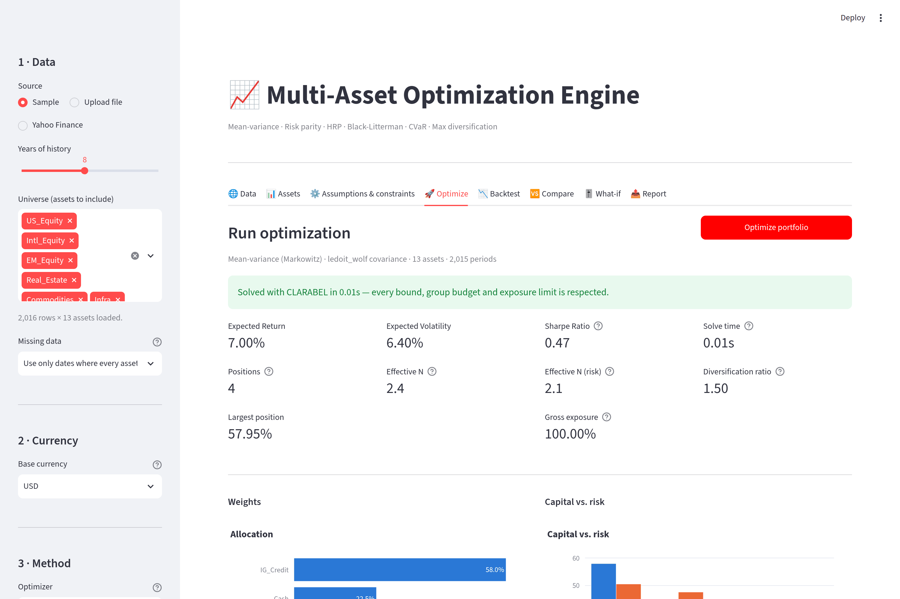
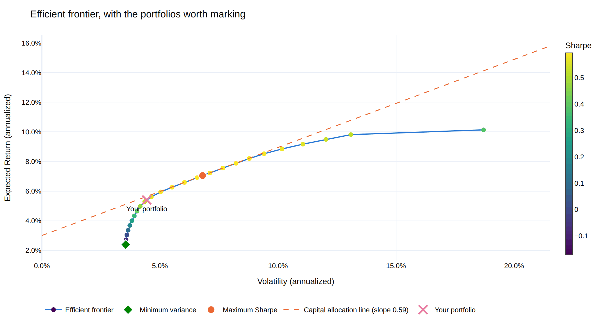
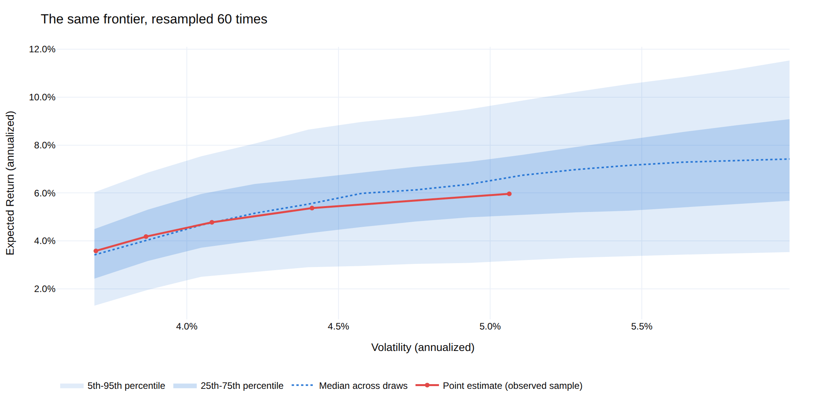
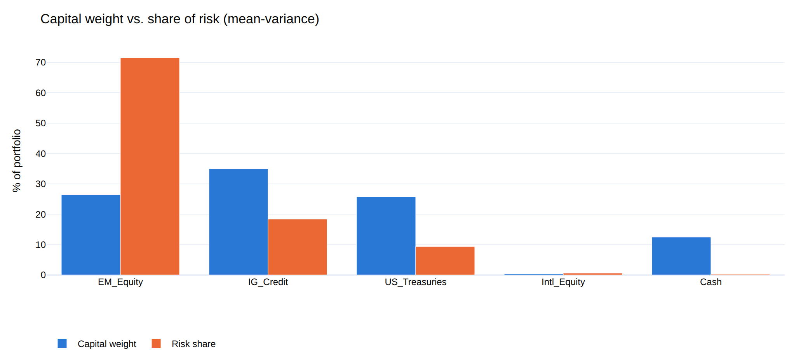
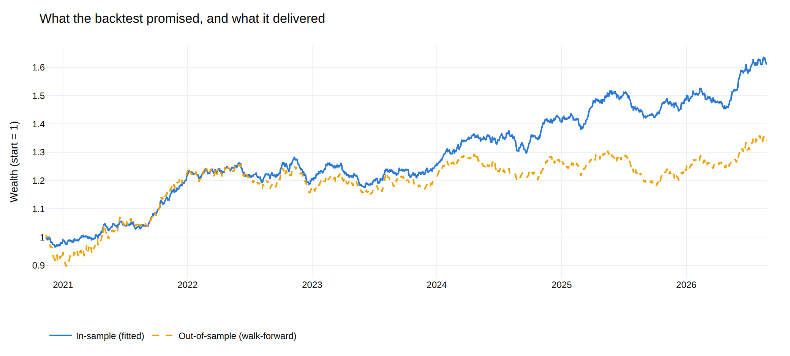
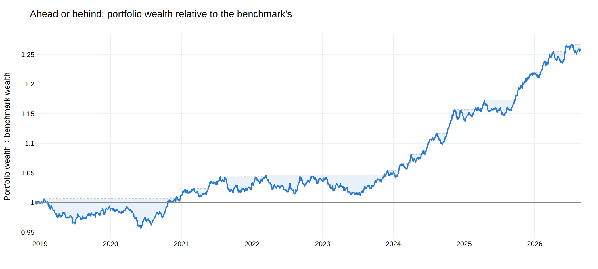
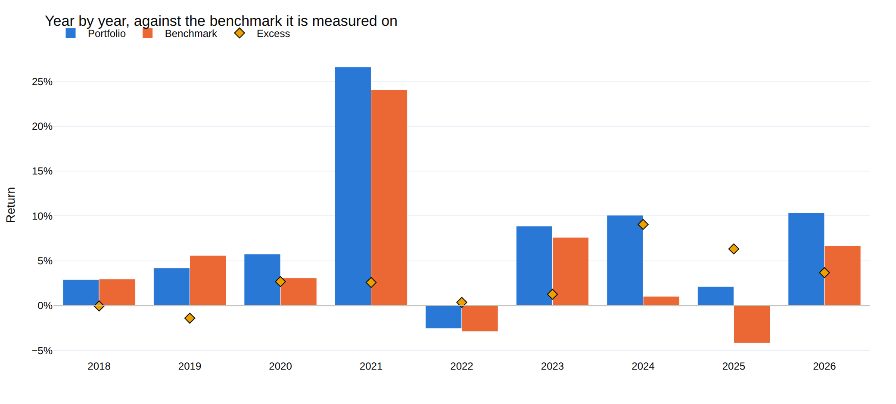
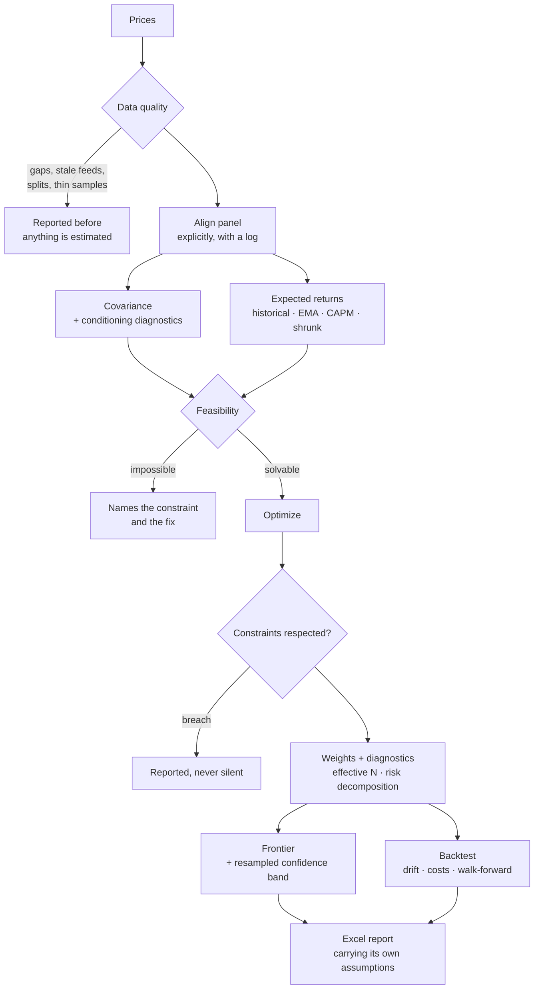
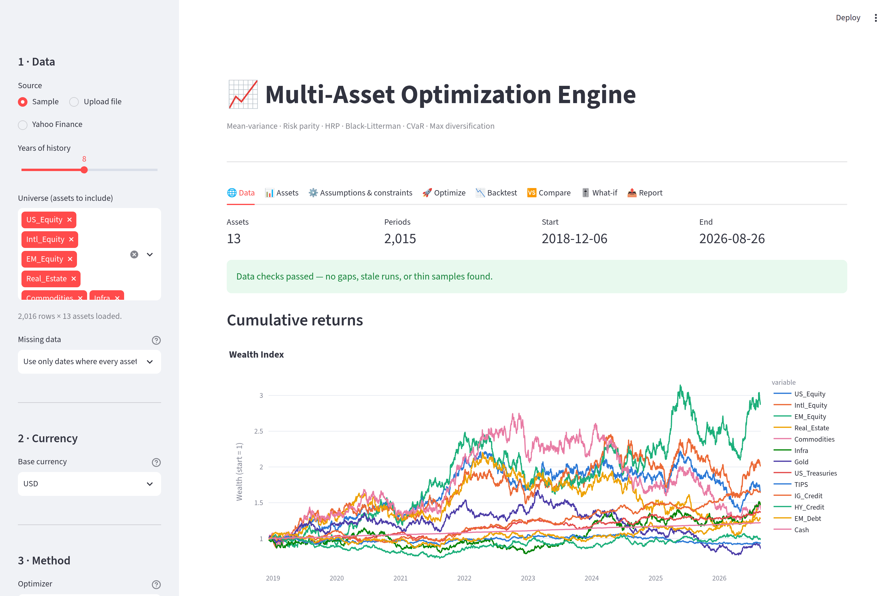
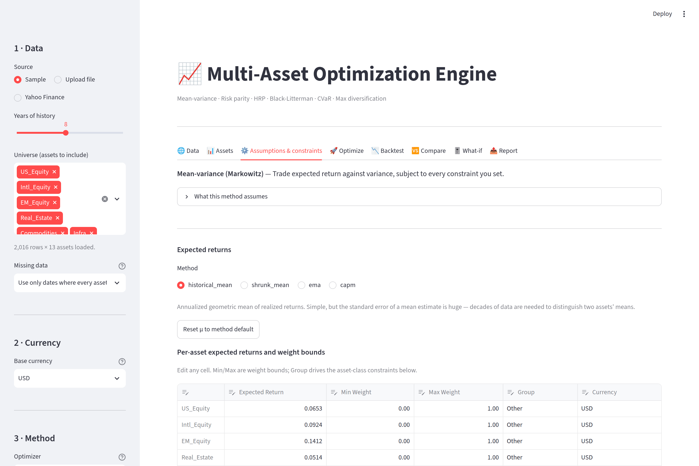

# Optimization Engine

A multi-asset portfolio optimization engine with a clean API, a Streamlit
UI, and a CLI. Built on top of `cvxpy`, `scipy`, `pandas`, and `plotly`.

The engine is opinionated about one thing: **an allocation is not a result
until you can see what it rests on.** Every solve returns the weights *and*
the evidence — which solver answered, whether the constraints were actually
respected, how well-conditioned the covariance estimate was, how concentrated
the book is in risk rather than capital, how much of the backtest survives out
of sample, and how much of *that* survives the number of configurations you
tried before settling on this one.



## The five questions it answers

### 1. Where does this portfolio sit, and what else was available?

The frontier is drawn with the portfolios worth marking on it — the
minimum-variance anchor where the efficient branch starts, the tangency
portfolio, the capital allocation line through it, and where your own
allocation actually landed. The sweep range comes from what the constraints
can reach, so a binding position cap shortens the curve instead of silently
failing half of it.



### 2. How much of that curve is real?

The frontier is a point estimate of a curve. Resample the return history and
re-trace it, and the curve moves a great deal: on the sample panel the
expected return at a typical risk level spans a **6.3-percentage-point band**.
Differences narrower than that band are not distinguishable from estimation
noise, which is a useful thing to know before defending a 20bp allocation
difference in a meeting.



### 3. Where is the risk, as opposed to the money?

Capital weight and risk share are different quantities, and optimizers are
happy to let them diverge. Here a 26% position in EM equity carries **71% of
the portfolio's risk** — the gap between the two bars is the entire argument
for risk budgeting, and it is invisible in a weights table.



### 4. Would any of this have worked?

The optimizer estimated its inputs from the same returns a naive backtest
replays, so a fitted track record is a description of the past, not a
forecast. The walk-forward re-estimates and re-solves on a rolling window and
holds each solution over returns the optimizer never saw. Same rebalancing
cadence and the same 15bps of trading cost on both lines, so the gap is
overfitting rather than a cost artefact: **Sharpe 0.74 fitted against 0.23
walk-forward.**



### 5. Is any of that real, or did you try forty things and report the best?

A library with ten methods, six covariance estimators and a grid of
constraints makes it easy to run forty configurations and present the winner.
The maximum of forty noisy estimates is a biased estimate of the best true
value, and nothing about that bias shows up in the number itself.

Take 50 strategies drawn from the *same zero-mean distribution* — no skill
anywhere. The best posts an annualized Sharpe of 1.24, and the probabilistic
Sharpe ratio calls it significant at 99.3%. Deflate it for the fact that it was
the best of 50 and it drops to **45.9%**: a coin flip, which is what it is.

`optengine optimize --trials 40` makes that declaration part of the run, and
`probability_of_backtest_overfitting()` asks the complementary question — across
every balanced split of the sample, how often does the in-sample winner land
below the out-of-sample median?

There is a prior question too, which `monte_carlo_optimization_selection()`
answers: given a universe like this one and a sample this long, which method
can be trusted to find the right answer at all? On the sample panel a direct
mean-variance solve misplaces its weights by 14.8% RMSE between simulated
histories drawn from the same distribution. Nested Clustered Optimization
misplaces them by 0.01%.

*Every figure in this README is produced by `python scripts/render_docs_images.py`
from the built-in sample dataset, using the same plotting code the app calls —
so what the README shows is what the library draws.*

## What's inside

**Optimization techniques**


| Method | Class | When to use |
| --- | --- | --- |
| Mean-variance (target return / vol / utility) | `MeanVarianceOptimizer` | Classic Markowitz with full constraints |
| Active mean-variance (vs a benchmark) | `ActiveMeanVarianceOptimizer` | The mandate is relative: excess return against an active-risk budget |
| Global minimum variance | `MinVarianceOptimizer` | You don't trust any expected-return estimate |
| Maximum Sharpe ratio | `MaxSharpeOptimizer` | Tangency portfolio, sized separately against cash |
| Risk parity / risk budgeting (ERC) | `RiskParityOptimizer` | Spread *risk* evenly, not capital |
| Hierarchical Risk Parity (HRP) | `HRPOptimizer` | Many assets, ill-conditioned covariance, small T/N |
| Hierarchical Equal Risk Contribution (HERC) | `HERCOptimizer` | HRP's robustness, but splitting at the tree's own branches — and optionally on drawdown or tail risk |
| Nested Clustered Optimization (NCO) | `NCOOptimizer` | Mean-variance keeps producing corner solutions on a correlated universe |
| Black-Litterman | `BlackLittermanOptimizer` | A few specific views on top of equilibrium |
| Mean-CVaR (Rockafellar-Uryasev) | `CVaROptimizer` | Skewed or fat-tailed returns; variance is the wrong measure |
| Mean-CDaR (Chekhlov-Uryasev) | `CDaROptimizer` | The mandate is written in drawdown terms — a stop-loss, a high-water mark |
| Maximum diversification | `MaxDiversificationOptimizer` | Correlation benefit as the objective |
| Inverse volatility | `InverseVolatilityOptimizer` | Cheap risk-parity approximation |
| Equal weight (1/N) | `EqualWeightOptimizer` | The baseline everything else has to beat |

`optengine describe <name>` prints what a method needs, what it supports, and
what it assumes — the same text the UI shows next to the method picker.

**Constraints**

* Per-asset weight bounds.
* **Layered allocation limits** — any number of levels, all binding at once:
  asset class (equity ≤ 60%, fixed income ≤ 30%, commodities ≤ 10%),
  sub-asset class inside each of those (developed ≤ 40%, emerging ≤ 20%), and
  a currency split cutting across all of them (foreign FX ≤ 30%). A level's
  limits are read either as a share of the whole book or as a share of the
  parent bucket — "30% emerging" can mean 30% of the portfolio or 30% *of the
  equity sleeve*, and the second one moves with whatever the optimizer
  allocates to equity. Both are linear in the weights, so the problems stay
  convex; see [Layered constraints](#layered-constraints).
* Long-only or long-short with a gross-exposure cap.
* Target return, target volatility, or risk-aversion utility.
* Turnover budget against a previous allocation.
* Tracking-error budget and active-share cap against a chosen benchmark.

Every constraint is honoured by every method, but not always the same way.
Convex solves impose them directly; the allocate-then-constrain methods (1/N,
inverse volatility, HRP) project onto the *closest* feasible allocation and
report how far the mandate moved their answer — because a 1/N book that had
to shift 15% of its weight is no longer really 1/N. Where a constraint truly
cannot bind (a turnover budget on the homogeneous max-Sharpe,
max-diversification and risk-parity solves), the method warns rather than
ignoring it silently. The benchmark-relative limits do carry into those
homogeneous solves: under `w = y/κ` an active-share cap becomes
`‖y − κb‖₁ ≤ 2·AS·κ` and a tracking-error budget the second-order cone
`‖Σ^½(y − κb)‖₂ ≤ TE·κ`, so the tangency and maximum-diversification
portfolios honour an active-risk mandate instead of reporting a breach
afterwards. After every solve the weights are checked against every
constraint and any breach is reported.

**Covariance estimators**

`sample`, `ledoit_wolf`, `oas`, `ewma` (RiskMetrics), `semi`,
`shrink` (riskfolio passthrough when installed), and `denoised`.

Every estimate is symmetrized and PSD-repaired, and comes with diagnostics:
observations per asset, condition number, smallest eigenvalue, and effective
sample size — with a warning when the estimate is too thin or too
ill-conditioned to optimize against.

Shrinkage pulls the whole matrix toward a target, attenuating signal and noise
alike. **Denoising** (López de Prado, 2020) is a sharper instrument: fit the
Marchenko-Pastur law to the eigenvalue spectrum, replace the eigenvalues below
the noise edge λ₊ with their average, and leave the factor eigenvectors
untouched. **Detoning** additionally strips the market eigenvector, which is
what the clustering methods want to see — with the market component in place
every pair of equities looks alike and the hierarchy degenerates.

Both compose with any estimator (`covariance_matrix(..., denoise=True,
detone=1)`), and both report what they found rather than what they hoped for:

```
Marchenko-Pastur fit on 2015 observations of 13 assets (T/N = 155.0) put the
noise edge at λ₊ = 1.167. 2 of 13 eigenvalues sit above it, carrying 62.9% of
total variance. The correlation's condition number went 18.4 → 11.2; the
covariance's went 1.25e+04 → 1.23e+04 — so this covariance's conditioning is
driven by the spread of the volatilities, not by correlation noise, and no
eigenvalue filter will improve it.
```

That last clause is the honest half. Denoising did what it claims and this
panel's problem was somewhere else.

**Expected returns**

`historical_mean`, `ema`, `capm`, and `shrunk_mean` (Jorion Bayes-Stein
shrinkage toward the minimum-variance portfolio's return, which keeps the
cross-sectional ranking while pulling in the extremes that drive
mean-variance to corner solutions).

**Analytics**

*Absolute* — drawdown episodes with recovery timing, Ulcer index, time under
water, VaR/CVaR (historic and Cornish-Fisher), Sharpe, probabilistic Sharpe,
Sortino, Calmar, Martin, Omega, gain-to-pain, win/loss ratio, tail ratio, hit
rate, best and worst single period, rolling metrics, Newey-West annualized
volatility, the full Euler risk decomposition in volatility units, and
concentration measures (Herfindahl, effective N, effective N of *risk*,
diversification ratio).

*Relative* — annualized excess return, tracking error and its downside half,
information ratio, CAPM alpha with its t-statistic and R², beta and
conditional (up/down) beta, up/down capture and the up/down *count* ratios,
batting average, Treynor, M², the appraisal ratio, relative drawdown against
the benchmark's wealth curve, the probability that the true excess return is
positive, and active share.

`performance_report()` assembles both halves into one object — headline
figures, calendar-period returns, rolling absolute and rolling relative
frames, drawdown episodes — computed on **one aligned sample**, which is the
point of having it. Assembling the two halves separately is how a report ends
up quoting a Sharpe ratio from ten years of history next to an information
ratio from the benchmark's shorter five, with nothing in the output saying so.
It exports as an Excel workbook or as a tidy long-form `block, series, metric,
value` table that survives a CSV round-trip and a diff against last quarter's
run.

**How many bets is this, really?**

Effective N counts positions and effective N of risk counts risk shares, but
both are computed asset by asset — so neither notices that ten European bank
stocks are one bet. Meucci's effective number of bets rotates the portfolio
into *uncorrelated* factors first. The two available rotations disagree, and
the disagreement is the diagnostic. An equal-weight book on the sample panel:

| Rotation | Effective bets | Largest single bet |
| --- | --- | --- |
| Minimum torsion | 9.78 of 13 | 15% |
| PCA | 1.56 of 13 | 89% |

Thirteen distinct, nameable positions; one dominant driver. `run.diversification_comparison()`
reports both, because neither is "the" answer — PCA measures how much
independent variation you are exposed to, minimum torsion how many distinct
positions you take.

**Measured against what?**

A benchmark enters the engine in two places, and the engine insists they are
the same one. A `BenchmarkSpec` states the choice once — 1/N, a single asset,
an explicit policy vector, or an external index carried alongside the
universe — and both uses read it:

* as a **return stream**, for every relative statistic above;
* as a **weight vector**, for active share, the tracking-error decomposition,
  and the two constraints that turn the benchmark from a reporting choice into
  an optimization input.

Not every kind supplies both. An external index is a return series with no
holdings in the investable universe, so asking it for an active share raises
rather than inventing one — and the UI greys the cell instead of printing a
number that means nothing.

The rebalancing convention is stated rather than assumed: `periodic` restores
the stated weights every period, which is what published index returns do and
what `(returns · w).sum()` computes; `buy_and_hold` invests once and lets the
winners compound into a larger share. Over a long sample those are materially
different track records.

Setting a tracking-error budget changes what gets solved. On the sample panel,
mean-variance at λ = 3 against a 1/N benchmark, rebalanced quarterly at 15bps:

| Active-risk budget | Return | Sharpe | Excess | T.E. | Information ratio | Active share |
| --- | --- | --- | --- | --- | --- | --- |
| unconstrained | 9.34% | 0.68 | 4.14% | 5.03% | 0.82 | 76.9% |
| ≤ 3% | 8.27% | 0.61 | 3.08% | 3.01% | **1.02** | 54.3% |
| ≤ 1.5% | 7.14% | 0.47 | 1.94% | 1.53% | **1.27** | 27.7% |

The budget binds exactly, and tightening it *raises* the information ratio
while lowering absolute return: the mandate spends less active risk and spends
what is left more efficiently. That is an in-sample result on one panel, not a
law — but it is the trade-off the constraint exists to let you see, and it is
invisible in an absolute report.

What "3.08% of excess return" felt like to hold is a different question, and
the relative wealth curve is the one that answers it. This is the ratio of the
two wealth curves, not the compounded excess return — compounding a difference
of returns as though it were a return overstates the gap, and the error grows
with the sample. The shaded bands are relative drawdown: the stretches during
which the portfolio was behind the index it is measured on, which is what a
client remembers and what no absolute chart shows.



Annualized figures hide the shape of a record, so the same report tabulates it
period by period. Here the portfolio beat the index in seven of the nine
calendar periods, and the two it lost were the first two — a shape that a
single information ratio summarises away, and that decides whether anyone is
still invested by the third year.



`active_mean_variance` goes further and optimizes in active space directly:
maximize `α'x − λ·x'Σx` over `x = w − b`, or maximize expected active return
subject to `√(x'Σx) ≤ TE*` when a budget is set. With `b = 0` it reduces
exactly to `mean_variance`, which is the check that the reformulation is not
quietly a different problem.

**Active management (Grinold-Kahn)**

For a portfolio measured against a benchmark, the engine computes the pieces of
the fundamental law `IR ≈ TC · IC · √BR`:

* The **information coefficient** from a forecast panel, with the t-statistic
  that says whether the skill is distinguishable from zero.
* The **transfer coefficient** — how much of the forecast survived the mandate.
  The engine knows exactly which constraints were applied and what the
  unconstrained answer would have been, so this is a measurement rather than an
  estimate. A transfer coefficient of 0.35 says two thirds of the skill is
  being absorbed by the constraints, which points at a different fix than "get
  better signals".
* **Grinold's alpha**, `α = IC · σ · z`, which turns a score into a defensible
  expected return. With an IC of 0.05, a two-standard-deviation view on a
  20%-vol asset is worth 2% — not the 10% that gets typed into a spreadsheet,
  and the difference is exactly what stops mean-variance cornering.
* **Risk-aversion calibration**, `λ_A = IR / (2ψ*)`: a tracking-error budget
  and a believed information ratio imply the utility coefficient, rather than
  it being guessed.
* The Euler decomposition of **tracking error**, which disagrees with the
  absolute one precisely on the large benchmark positions that carry plenty of
  risk and no *active* risk at all.
* `implied_breadth()` run backwards is a plausibility check: an IR of 1.0 on an
  IC of 0.03 needs 1,111 independent bets a year.

**Estimation error**

The engine spends a lot of effort saying that expected returns and
covariances are noisy — condition numbers, T/N ratios, walk-forward
degradation — so it does not then draw the frontier as a single crisp line and
leave it there:

* `bootstrap_frontier()` resamples the return history (block, IID or
  parametric), re-estimates and re-traces the frontier on each draw, and
  returns the resulting confidence band plus the per-asset weight dispersion.
  On the sample panel the frontier's expected return spans a 6.3-percentage-
  point band at a typical risk level — differences narrower than that are not
  distinguishable from noise.
* `resampled_efficient_frontier()` implements Michaud-style resampling:
  averaging weights across draws at each frontier rank, which lifts the mean
  effective N from 3.3 to 5.2 on the sample panel because the optimizer stops
  acting on differences the data cannot resolve.
* `monte_carlo_optimization_selection()` asks the prior question: given a
  universe like this one and a sample this long, *which method can be trusted
  to find the right answer at all?* It declares the fitted `μ` and `Σ` to be
  the truth, draws synthetic histories from them, re-estimates and re-solves on
  each, and measures how far each method lands from the answer that truth
  implies (López de Prado, 2019). Over 20 draws on the sample panel:

  | Method | Weight RMSE | Worst single position |
  | --- | --- | --- |
  | `nco` | 0.01% | 0.01% |
  | `herc` | 0.02% | 0.05% |
  | `hrp` | 0.05% | 0.13% |
  | `min_variance` | 0.59% | 1.51% |
  | `mean_variance` | **14.79%** | **35.53%** |

  Each method is scored against *its own* answer on the truth, not a common
  one — the question is estimation stability, not which objective is right.

**Selection bias**

Running forty configurations and reporting the best one is easy in a library
with ten methods, six covariance estimators and a grid of constraints. The
maximum of forty noisy estimates is a biased estimate of the best true value,
and nothing about that bias is visible in the number itself.

* `deflated_sharpe_ratio()` (Bailey & López de Prado, 2014) deflates against
  the expected maximum across the trials you actually ran, adjusted for skew
  and kurtosis. Take 50 strategies drawn from the *same zero-mean
  distribution*: the best posts an annualized Sharpe of 1.24 and a
  probabilistic Sharpe of 99.3%. Its deflated Sharpe is **45.9%**.
* `minimum_track_record_length()` says how much history you would need before
  the observed Sharpe is significant. Usually a bracing answer.
* `probability_of_backtest_overfitting()` implements CSCV: across every
  balanced split of the sample, how often does the in-sample winner land below
  the out-of-sample median? Above ~50% your selection process is a coin flip.

`optengine optimize --trials 40` makes the declaration explicit. The default of
1 is a claim, and the output says so.

**Backtesting**

The simulation lives in `optimization_engine.backtest`, organized around one
boundary: a **stateless core** that turns weights into a track record, and the
layers that judge what came out. The core reads no files, keeps no state
between calls, and is deterministic given its inputs — which is what makes the
diagnostics above meaningful and lets a whole grid be run without the cells
interfering with each other.

`BacktestSpec` is the declarative description of a run: cadence, cost model,
execution lag, annualization. It is data rather than code, so it serializes,
diffs, and hashes. Two runs carrying the same `spec_hash` were asked the same
question; `result_hash` says whether they got the same answer.

```python
from optimization_engine import BacktestSpec, CostSpec, run_backtest

spec = BacktestSpec(
    frequency="monthly",
    costs=CostSpec(commission_bps=8, slippage_bps=4, impact_coefficient=0.4),
    execution_lag=1,          # decide on the close, fill on the next one
)
run = run_backtest(returns, weights, spec)
```

Three things that in-sample constant-weight replays quietly assume away:

* **Drift and rebalancing.** Positions grow with their own return between
  trades; pulling them back costs money. `run_backtest()` reports held weights
  (not targets), per-trade costs, turnover, and NAV.
* **Execution.** `execution_lag` separates the date a target is chosen from the
  date it is traded. At zero — the conventional default — the book fills on a
  close it has not seen.
* **Cost that scales.** `CostSpec` splits commission (a broker problem) from
  slippage and market impact (a size problem). With `impact_coefficient` set,
  cost follows the square-root law `eta · sigma · sqrt(q / participation)`, so
  the same allocation gets more expensive as the book grows — the only way
  capacity shows up in a backtest at all. When the trailing volatility behind
  that estimate is missing, the trade degrades to the linear charge and the run
  says so on `meta.degradations` rather than silently charging zero.

`walk_forward_run()` re-estimates and re-solves on a rolling (or expanding)
window and holds each solution forward over returns the optimizer never saw;
a failed solve carries the previous book forward and is recorded, because
skipping the period would delete a real cost from the track record.
`compare_in_and_out_of_sample()` puts the two track records side by side with
the degradation between them.

On top of the core:

* `compute_tca()` — the cost panel. A total is uninformative on its own, so it
  normalizes: cost per unit of traded notional, cost per rebalance, annualized
  drag, and the commission/impact split. Ratios that cannot be computed come
  back as `None` *with a reason*, never as a zero that reads like a
  measurement. `cost_by_asset()` says where it went.
* `compute_position_stats()` — the round trips hiding in the weight path. Every
  asset's stay in the book is an episode with a contribution and a holding
  period, so the usual win rate, profit factor and payoff ratio apply. A Sharpe
  earned by three names is a different risk from the same Sharpe earned by two
  hundred, and the return curve cannot tell you which one you have.
* `run_sweep()` — grids, with the discipline that makes them safe. `SweepResults`
  **cannot represent a partial grid**: the invariant is checked on construction,
  and a cell that fails to build or fails to solve becomes an error *row*, never
  a missing one. There is deliberately no `best()`, no `top_n()`, no sort by
  Sharpe. What it does give you is the trial count — the input the deflated
  Sharpe and the overfitting probability both need, and the one nobody records.
  `results.deflated_sharpe(cell)` and `results.overfitting_report()` wire
  straight into §5 above.
* `final_holdout_run()` — the segment nothing was fitted on, and the audit log
  that keeps it that way. `gate_returns()` physically truncates the history
  before any run can see it; `assert_within_holdout()` fails loudly if
  untruncated data reaches a gated path anyway. Every visit to the held-out
  segment is appended to a JSONL log, and repeat visits earn flags: `REPEATED`
  for the same specification seen twice, `SHIFTED_HOLDOUT` for the same strategy
  evaluated against a boundary that *moved*. The flags block nothing. They make
  the second look visible, which is all a diagnostic can honestly do.
* `build_tearsheet()` — the assembled reading. Performance, drawdowns, costs,
  position statistics and the selection-bias correction in one object, with the
  caveats attached to the numbers rather than to a footnote. A tearsheet over an
  in-sample, costless, same-period-fill run says all three things out loud.

  Expected returns are re-derived inside each window by default
  (`reestimate_expected_returns=True`). This matters more than it sounds:
  `config.expected_returns` is normally populated — the UI seeds that table
  from the *full* history — so reusing it would hand every "out-of-sample"
  window an estimate built partly from its own future. On the sample panel
  that look-ahead lifts walk-forward Sharpe from 0.46 to 0.89. Turn it off
  only when your expected returns are genuine forward-looking assumptions
  rather than estimates from the same data.

## How a run flows



## Layout

```
src/optimization_engine/
├── analytics/        # performance · risk · relative · backtest (compact API)
│                     # active (Grinold-Kahn) · diversification (Meucci)
│                     # selection (deflated Sharpe · PBO)
├── backtest/         # spec · costs · calendar · runner · results (the core)
│                     # walkforward · tca · positions · sweep · holdout
│                     # tearsheet
├── data/             # loaders · covariance · denoising · data-quality
├── optimizers/       # one file per technique + diagnostics + feasibility
├── reporting/        # Excel exporter + Plotly figures
├── benchmark.py      # what the portfolio is measured — and optimized — against
├── config.py         # YAML/JSON-driven config
├── engine.py         # high-level façade (run_engine)
├── frontier.py       # efficient frontier sweep
├── resampling.py     # bootstrap bands · Michaud resampling · MCOS
└── cli.py            # `optengine` entrypoint
app/
├── streamlit_app.py  # interactive UI
└── components.py     # reusable render blocks
config/               # example configs
docs/RESEARCH.md      # the literature behind the methods, and what was left out
docs/images/          # README figures (regenerate with scripts/)
notebooks/            # quickstart notebook
scripts/              # batch runners + docs-figure renderer
tests/                # pytest suite
```

## Install

```bash
pip install -e ".[ui,extras,dev]"
```

The `extras` pull `riskfolio-lib`; `ui` pulls Streamlit and ipywidgets.
Without `extras` the engine falls back to scikit-learn's Ledoit-Wolf for
the `shrink` covariance method.

## Use it

### Streamlit UI

```bash
streamlit run app/streamlit_app.py
```

The sidebar walks a numbered path — **Data → Currency → Method →
Assumptions → Objective → Benchmark → Exposure → Frontier** — and each step
surfaces what could make the next one wrong.

1. **Data** — data-quality report before anything is estimated: interior
   gaps, stale feeds that read to an optimizer as low volatility, unadjusted
   splits, and how many periods actually have every asset present. The
   missing-data policy is an explicit choice, and the app logs exactly what it
   did to the panel.

   
2. **Assets** — per-asset statistics (extended metrics on a toggle) plus a
   drawdown-episode table with peak, trough, recovery and time underwater.
3. **Assumptions & constraints** — editable expected returns, weight bounds,
   asset-class budgets, a **layered-limit builder** where you add as many
   levels of the mandate as it has (name the buckets, assign assets from a
   dropdown or fill them in one click from the Group or Currency column, and
   cap each bucket as a share of the portfolio or of its parent), per-method
   inputs (risk budgets, Black-Litterman views both absolute and relative,
   cluster counts and linkage for HERC/NCO, the CDaR tail), the covariance
   estimator with its **denoising and detoning** toggles, and a **live
   feasibility check** that names the constraint making the problem
   impossible and what to change, before you ever press solve.

   
4. **Optimize** — a compliance banner, KPI cards, concentration and
   diversification measures, a **policy-exposure table** that says where the
   book landed on every layer and marks which bucket actually stopped it, a
   capital-vs-risk chart, the full Euler decomposition (with risk shares per
   layer, because a 30% bond sleeve rarely carries 30% of the risk), and a
   frontier marked with the minimum-variance and
   tangency portfolios, the capital allocation line, and where your portfolio
   actually sits — plus an opt-in panel that redraws the frontier as a
   confidence band and names the positions the sample cannot pin down.
5. **Backtest** — choose a rebalancing cadence, an execution lag, and a cost
   model split into commission, spread and square-root market impact; see
   weight drift, cost drag, where the cost went by name, rolling performance,
   the return distribution with its VaR/CVaR cuts, and a walk-forward run that
   says in words how much of the result was hindsight.
6. **Performance** — absolute and relative on one page, both computed on the
   same aligned sample: KPI cards for each, cumulative wealth against the
   benchmark and the *relative* wealth curve with its underwater band,
   calendar-period bars, rolling absolute and rolling relative panels, a
   risk-return scatter placing the portfolio and its benchmark among the
   assets they are built from, and the full tables. Exports as a workbook or
   as a tidy metrics CSV.
7. **Compare / What-if** — saved scenarios side by side, and live re-solving
   as you drag weight bounds.
8. **Report** — one-click Excel export carrying assumptions, diagnostics,
   data-quality findings, the benchmark and active weights, the full
   performance report and the walk-forward comparison alongside the weights.

The **Benchmark** step is one choice that everything downstream reads: the
relative block on the backtest page, the performance page, the workbook, and —
when you set a tracking-error or active-share limit — the solve itself. Any
series you load but leave out of the universe is offered there as an external
benchmark, so pulling `^GSPC` alongside your tickers and deselecting it is all
it takes to measure against the index.

The sidebar's **📚 Scenarios** block saves, updates, loads, renames, deletes,
and downloads/uploads named profiles (YAML).

### CLI

```bash
optengine list-optimizers                    # each method with a one-line summary
optengine describe hrp                       # what it needs, supports, assumes
optengine sample-data --output data/sample/sample_prices.csv

# Pre-flight the inputs and constraints without solving.
optengine check --config config/example_multi_asset.yaml --sample

# Solve, and refuse rather than fail obscurely if the mandate is impossible.
optengine optimize --config config/example_multi_asset.yaml --sample \
    --frontier --resample 50 --walk-forward --cost-bps 10 --strict

# Filter the covariance's noise eigenvalues, declare how many configurations
# you tried, and rank the methods by how reliably each recovers the truth.
optengine optimize --config config/example_multi_asset.yaml --sample \
    --denoise --walk-forward --trials 40 --mcos 20

# Measure against a benchmark, and hold the solve to an active-risk budget.
# --benchmark takes a kind ('equal_weight'), an asset name, or 'none' to
# override whatever the config's benchmark block says.
optengine optimize --config config/example_multi_asset.yaml --sample \
    --benchmark equal_weight --max-tracking-error 0.03 --max-active-share 0.5

# Walk the process forward, price the trading properly, and count the trials.
# --execution-lag defaults to 1: a desk does not trade on a close it has not
# seen. Every sweep cell is walk-forwarded, and its trial count is carried into
# the deflated Sharpe rather than left for the reader to guess.
optengine backtest --config config/example_multi_asset.yaml --sample \
    --commission-bps 8 --slippage-bps 4 --impact-eta 0.4 \
    --sweep optimizer.name=min_variance,risk_parity,equal_weight \
    --output backtest.xlsx

# Withhold everything after a date, walk forward on the rest, then look at the
# held-out segment once — and write that look down.
optengine backtest --config config/example_multi_asset.yaml --sample \
    --commission-bps 10 --holdout 2024-01-01
```

`backtest` prints what the strategy earned out of sample, what the trading cost
to get it, and how much of the remaining Sharpe survives being deflated for the
size of the search. It ends with the caveats the run did *not* answer — costs
not modelled, orders filled on a price nobody could have traded at, a Sharpe
nobody deflated. A second visit to the same holdout comes back flagged
`REPEATED`; the same strategy against a boundary that moved comes back
`SHIFTED_HOLDOUT`.

A benchmarked run prints the relative headline alongside the absolute one, and
the workbook gains the benchmark, the active weights, and the full absolute
and relative performance report — plus the same report on the walk-forward
returns when `--walk-forward` is set, so the fitted information ratio sits
next to the out-of-sample one.

`check` exits non-zero when the data has errors or the constraints have no
solution, so it drops straight into CI or a pre-commit hook.

### Python

```python
from optimization_engine import (
    EngineConfig, OptimizerSpec, run_engine,
    sample_dataset, prices_to_returns, analyze_prices,
)

prices = sample_dataset()
print(analyze_prices(prices).describe())

returns = prices_to_returns(prices)

config = EngineConfig(
    expected_returns={c: 0.05 for c in returns.columns},
    bounds={c: [0.0, 0.4] for c in returns.columns},
    optimizer=OptimizerSpec(name="risk_parity"),
)

run = run_engine(returns, config, build_frontier=True)
print(run.result.weights.round(3))
print(run.result.violations)          # empty when fully compliant
print(run.diagnostics.effective_n)    # concentration, not just position count
print(run.risk_decomposition())       # contributions in volatility units

# What survives out of sample?
wf = run.walk_forward(transaction_cost_bps=10)
print(run.in_vs_out_of_sample(wf))

# Measured against what? State it once, and both the report and the solve
# read the same answer.
from dataclasses import replace

from optimization_engine import BenchmarkSpec

relative = replace(
    config,
    optimizer=OptimizerSpec(name="mean_variance", risk_aversion=3.0),
    benchmark=BenchmarkSpec(kind="equal_weight"),
    max_tracking_error=0.03,          # binds inside the mean-variance solve
)
relative_run = run_engine(returns, relative)

report = relative_run.performance(frequency="monthly", transaction_cost_bps=10)
print(report.describe())              # one paragraph, hedged where it should be
print(report.relative.T)              # excess, T.E., IR, alpha and its t-stat,
                                      # capture, batting average, M², …
print(report.periods)                 # portfolio vs benchmark, year by year
report.metrics().to_csv("metrics.csv", index=False)   # tidy, diffable

# The same report, on returns this process never saw. Its own walk-forward,
# not the one above — that belonged to a different config.
relative_wf = relative_run.walk_forward(transaction_cost_bps=10)
print(relative_run.performance(returns_override=relative_wf.returns).describe())

# ...and how much of *that* is the forty configurations you tried first?
from optimization_engine import deflated_sharpe_ratio
print(deflated_sharpe_ratio(wf.returns, n_trials=40).describe())

# The full simulation stack: a validated spec, real execution, real costs.
from optimization_engine import BacktestSpec, CostSpec, SweepSpec

spec = BacktestSpec(
    frequency="monthly",
    costs=CostSpec(commission_bps=8, slippage_bps=4, impact_coefficient=0.4),
    execution_lag=1,
)
walk = run.walk_forward_run(spec=spec)
print(walk.run.meta.result_hash)      # same spec + same data => same hash
print(walk.run.trades.head())         # per-asset fills with the cost split
print(walk.weight_stability())        # is the optimizer chasing noise?

# Don't guess the trial count — run the grid and let it count itself.
sweep = run.sweep(SweepSpec(params={
    "optimizer.name": ["min_variance", "risk_parity", "equal_weight"],
    "covariance_method": ["sample", "ledoit_wolf"],
}))
print(sweep.describe())               # every cell, failures included
print(sweep.overfitting_report().describe())
print(sweep.deflated_sharpe(0).describe())

# One object with the numbers and the caveats attached to them.
sheet = run.tearsheet(walk.run, n_trials=sweep.n_ok,
                      trial_sharpes=sweep.trial_sharpes())
print(sheet.describe())
print(sheet.tca.to_frame())           # cost per notional, per trip, per year
print(sheet.positions.to_frame())     # win rate and holding period by position

# How many bets is this, once correlations are accounted for?
print(run.diversification_comparison())
```

### Layered constraints

A mandate is written in levels, and a single flat grouping can only express
one of them. `constraint_layers` takes as many as the policy has; all of them
bind at once.

```python
from optimization_engine import (
    EngineConfig, OptimizerSpec, currency_layer, layer_from_mapping, run_engine,
)

asset_class = {"SPY": "Equity", "EFA": "Equity", "EEM": "Equity",
               "AGG": "Fixed Income", "EMB": "Fixed Income", "GLD": "Commodities"}

config = EngineConfig(
    expected_returns=mu,
    # Layer 1: no more than 60% equity, 30% fixed income, 10% commodities.
    groups=asset_class,
    group_bounds={"Equity": [0.0, 0.60],
                  "Fixed Income": [0.0, 0.30],
                  "Commodities": [0.0, 0.10]},
    constraint_layers=[
        # Layer 2: inside equity, at most 30% emerging — of the *sleeve*, so
        # the cap moves with whatever the optimizer puts in equity. The parent
        # bucket of each child is derived from the assignments, not typed twice.
        layer_from_mapping(
            "Sub-asset class",
            {"SPY": "DM", "EFA": "DM", "EEM": "EM", "AGG": "DM FI", "EMB": "EM FI"},
            {"EM": 0.30, "EM FI": 0.25},
            basis="parent", parent="Asset class",
        ),
        # Layer 3: at most 30% foreign currency, cutting across both.
        currency_layer(
            "FX exposure",
            {"SPY": "USD", "EFA": "EUR", "EEM": "EUR",
             "AGG": "USD", "EMB": "USD", "GLD": "EUR"},
            base_currency="USD", foreign_max=0.30,
        ),
    ],
    optimizer=OptimizerSpec(name="max_sharpe"),
)

run = run_engine(returns, config)
print(run.layer_exposures())            # every bucket, its limit, its headroom
print(run.layer_risk_contributions("Sub-asset class"))   # risk, not capital
```

`layer_exposures()` restates a percent-of-parent limit as a share of the book
— a 30% cap on a 55% equity sleeve is a 16.5% cap on the portfolio — and marks
the buckets that are binding, which is the answer to "why this portfolio": a
book held at 60% equity by the asset-class cap is a different portfolio from
one held there because the emerging sub-limit ran out.

Every method honours every layer. The convex solves impose them directly; the
allocate-then-constrain methods project onto the closest feasible allocation
and report the distance. A percent-of-parent limit is homogeneous of degree
one, so it survives the change of variables in max-Sharpe and
max-diversification rather than being applied afterwards.

Before solving, `analyze_feasibility` checks each layer's arithmetic and says
what to change — caps that cannot fund a full book, a bucket with limits and
no members, sub-limits that cannot fill the sleeve they sit in, or a bucket
whose members straddle two parents (where "40% of the parent" has no meaning
and the engine refuses rather than guessing).

Which method should you even be using? Measure it rather than argue about it:

```python
from optimization_engine import monte_carlo_optimization_selection

selection = monte_carlo_optimization_selection(
    returns, config,
    methods=("mean_variance", "min_variance", "hrp", "herc", "nco"),
    n_simulations=20,
)
print(selection.describe())
print(selection.ranking())
```

For a benchmark-relative mandate, the Grinold-Kahn diagnostics:

```python
from optimization_engine import fundamental_law, grinold_alpha

config.benchmark_weights = {c: 1 / len(returns.columns) for c in returns.columns}
run = run_engine(returns, config)

# Needs an expected-return vector that actually varies across assets — a flat
# one carries no cross-sectional view, and the engine says so rather than
# returning a NaN you find out about later.
tc = run.transfer_coefficient()               # how much survived the mandate
print(fundamental_law(0.05, breadth=200, transfer_coefficient=tc).describe())
print(run.active_risk_decomposition())        # tracking error, not total risk

# Turn scores into expected returns you can defend. `scores` is your own
# cross-sectionally z-scored forecast; `residual_vol` is per-asset volatility.
alphas = grinold_alpha(scores, residual_vol, information_coefficient=0.05)
```

Relative (spread) Black-Litterman views:

```python
from optimization_engine import View

config.optimizer.name = "black_litterman"
config.optimizer.bl_views = [
    View({"US_Equity": 1.0, "EM_Equity": -1.0}, 0.03, label="US over EM"),
]
```

Note that Black-Litterman optimizes against its equilibrium *posterior*,
which normally sits well below historical means — a return target that suits
mean-variance is often unreachable here. `run_engine` checks the target
against the posterior and says so.

## Tests

```bash
pytest -q
ruff check src app tests scripts
```

The README figures are regenerated with:

```bash
python scripts/render_docs_images.py
```

The suite covers the covariance estimators and their PSD repair, every
optimizer, frontier monotonicity and reachability, ERC properties,
Black-Litterman blending with absolute and relative views, constraint
compliance, feasibility diagnosis, backtest drift/costs, walk-forward
look-ahead safety, data-quality detection, and the CLI's exit codes.

The methods added in 0.3 are tested against the claims that justify them, not
just for smoke: that the Marchenko-Pastur fit recovers a known number of
planted factors and improves conditioning while leaving the dominant
eigenvector alone; that the cluster search recovers a known block structure;
that NCO's weights move less than a direct solve's between two halves of the
same generated history; that mean-CDaR beats equal weight on realized maximum
drawdown; that the deflated Sharpe rejects the best of fifty skill-free
strategies while the probabilistic Sharpe accepts it; that the transfer
coefficient is exactly 1 for the unconstrained optimum, −1 for its negative,
and invariant to gearing; and that the minimum-torsion factors are uncorrelated
to machine precision.

The simulation stack is held to its own claims rather than to smoke: that a run
is reproducible — same spec and same data, same result hash — and that a
different cost model produces a different one; that an execution lag actually
leaves the book in cash until the order fills, and that an order which cannot
fill inside the sample never fills at all; that square-root impact charges
three times the rate for nine times the trade, and degrades *loudly* when the
volatility behind it is missing; that a cost ratio which cannot be computed
comes back as `None` with a reason rather than a zero; that a grid keeps its
failed cells as rows, so its trial count stays honest; and that a second visit
to the same holdout is flagged `REPEATED` while a boundary that moved is
flagged `SHIFTED_HOLDOUT`.

## Where the methods come from

[`docs/RESEARCH.md`](docs/RESEARCH.md) is the reading behind these methods: what
López de Prado, Cajas, Grinold & Kahn, Meucci, Raffinot and the rest actually
claim, which of it this engine implements, and — the part usually left out —
which of it was read and deliberately deferred, with the reason. If you want to
know why there is no EVaR here yet, that is where it says so.

## License

MIT — see [LICENSE](LICENSE).
